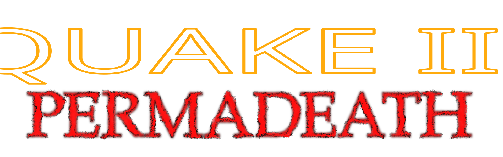
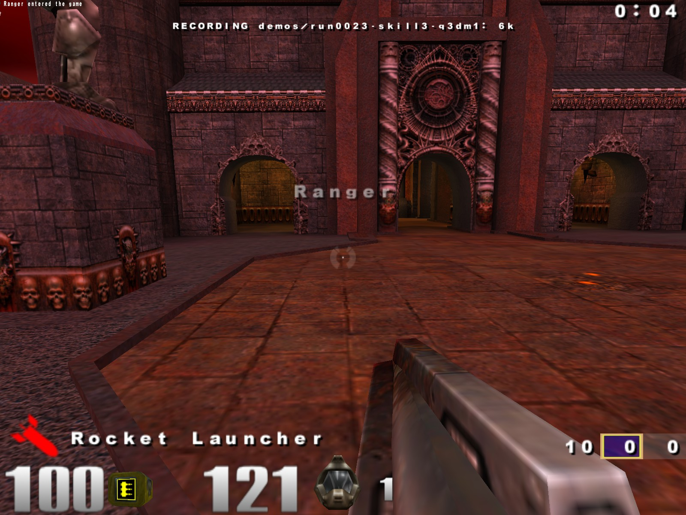
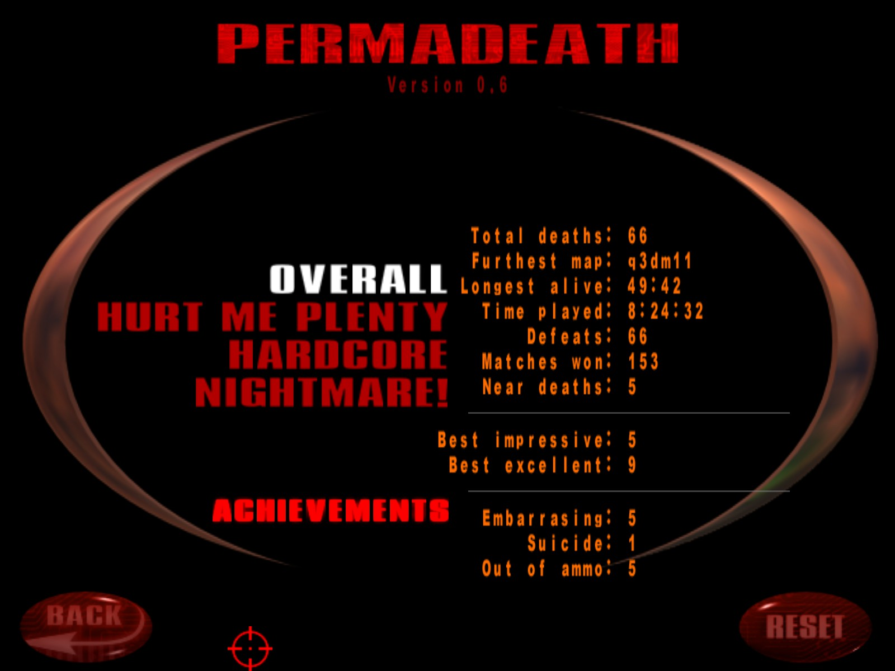

# Quake III: Permadeath



A single-player mod for Quake III Arena. Die once and your entire campaign progress resets.

---

## How to play

1. Go to Single Player
2. Defeat Crash
3. You get an extra life after completing a tier. The extra lives are shown in a small number next to your head. If it's invisible, it means you don't have any.
4. When you run out of lives, you are removed from the arena and the progress of your ENTIRE CAMPAIGN is reset (save for achievements and statistics, seen in the Permadeath menu)

### Extra lives

Earn one extra life per completed tier. When you die, a life is subtracted. As long as you have extra lives, you can continue respawning. You are still allowed to restart or even leave the arena, as long as you don't die.

> 
> Extra lives as shown near the health counter

### True Permadeath 

You can activate this to remove the Extra lives system: you die once, your entire campaign is reset.

> Can be switched here: `System -> Game Options`

### Game Over variants
Depending on how you die, a different screen is shown. Find them out :)

### New medal: Haste
Win a match under a specific per-map time threshold. The time threshold per map is based on the last-place speedrun.com entry × 1.5, rounded up to the nearest 10 seconds.

### Statistics (`Main Menu → Permadeath`)
Tracks per-difficulty (or a sum of it all).



### 🏅Achievements 
- **Tier completion** — one achievement per tier × difficulty (Hurt Me Plenty / Hardcore / Nightmare!), including a perfect-run tier.
- **Imperfect** — lose a match without dying.
- **Near death** — win a match with 25 HP or less.
- One achievement per Game Over variant found.
- More to come!

### 🔧Quality of Life
- **Auto-record** — (off by default) starts recording a demo on every map load, named `run####-skill#-mapname`. 

    * Found in `Setup → Game Options → Auto Record`.
- After the first run, most of the announcer's lines in the Introduction map are suppressed.
- Slight HUD changes:
    - Armor and ammo count turn white if above normal.
    - Health count had a red color that only started from 25. But you can already die quickly from more than that at once, so I changed its activation up to 60. But to not make it annoying while still alive, I changed its blinking animation to a sawtooth fade loop.
- More to come!

---

## Download

Grab the latest release from the [Releases page](https://github.com/cybernaut4/q3permadeath/releases/latest).

---

## Prerequisites

- Quake III Arena v1.32
- [ioquake3](https://ioquake3.org/) or [quake3e](https://github.com/ec-/Quake3e) (quake3e recommended — ioquake3 has degraded audio quality)

---

## Installation

1. Download `permadeath-vX.Y-release.zip` from the [latest release](https://github.com/cybernaut4/q3permadeath/releases/latest).
2. Extract the zip into your Quake III Arena directory. The `permadeath/` folder must sit alongside `baseq3/`, not inside it.
3. Launch the game and select **Mods → Permadeath**. 
> Note: if this fails, try this launch command instead:
> ```
>quake3.exe +set fs_game permadeath +set vm_cgame 0 +set vm_game 0 +set vm_ui 0 +set sv_pure 0
>```
> (replace `quake3.exe` with the ioquake port of your choice)
4. Go to **Single Player** and begin your journey.

---

## Krusade bot (optional, standalone)

This mod comes with a `krusade.pk3` file. 

It does NOT include its textures and model, as they're loaded from the original.

It allows Krusade to be invited as a bot, and comes with its own altered voice of Sarge. This serves as a prelude for the upcoming changes that add replayability for the Permadeath mod. 

You can drop it into any mod directory or `baseq3/` to use it in standard Q3A if you want.

---

## Roadmap

The roadmap can be found [here](./permadeath-roadmap.md). Note that any objectives and priorities written there can be changed at any time.